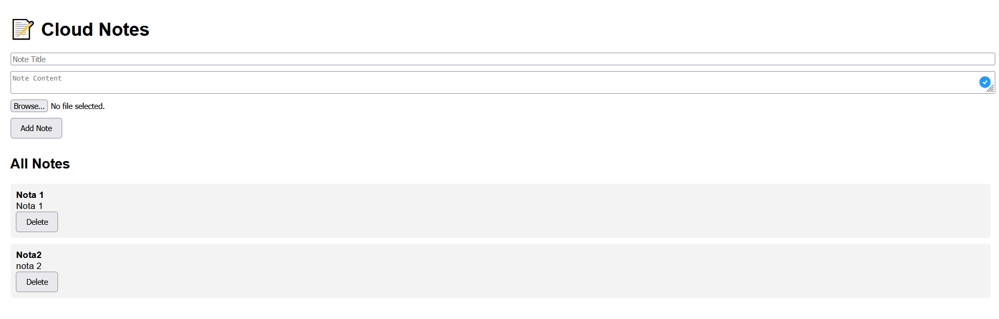
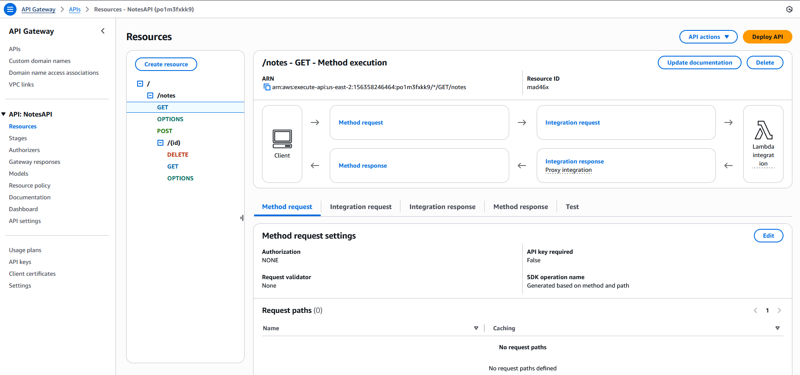
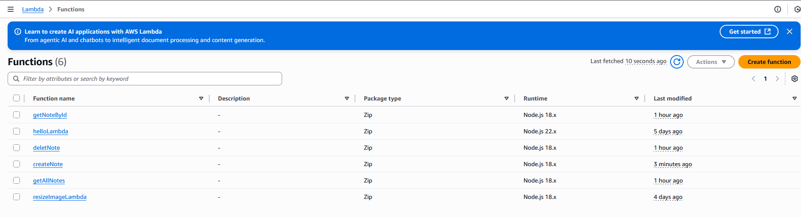
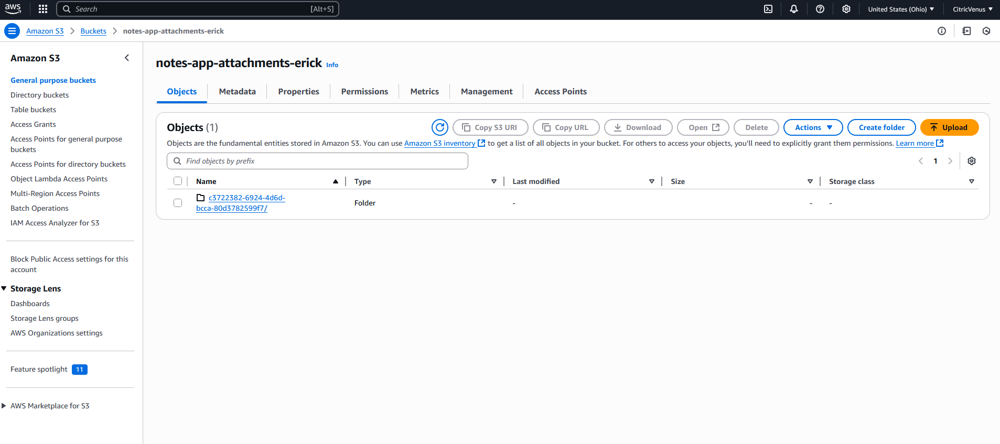
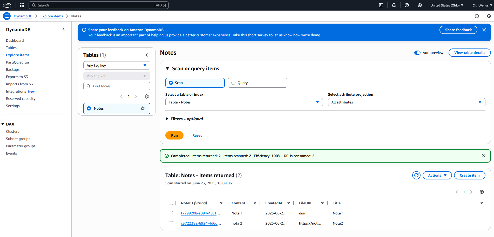
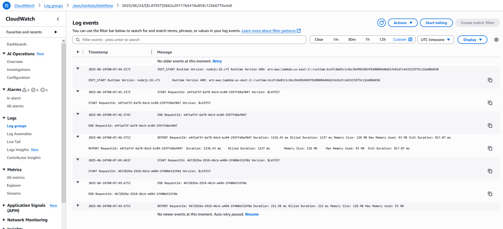
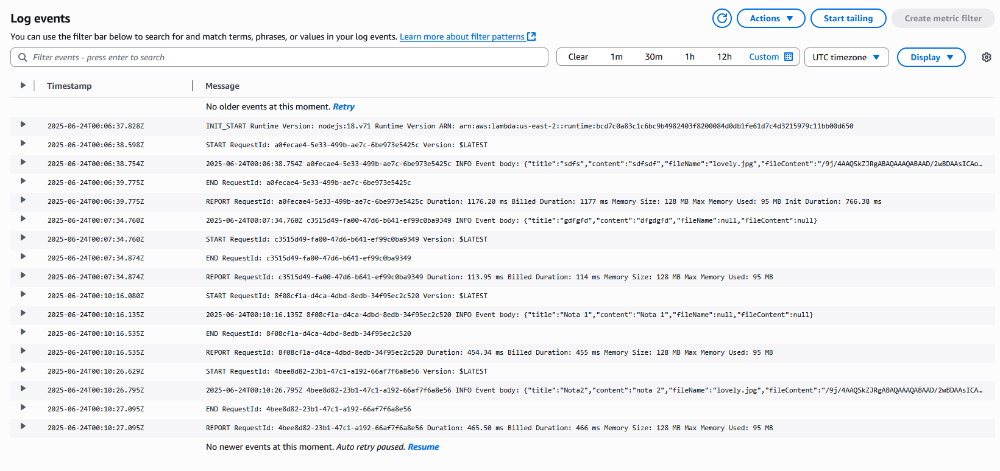

# Cloud-Based Notes App

Esta aplicación permite a los usuarios crear, almacenar y gestionar notas en la nube, con archivos adjuntos opcionales. Utiliza Amazon DynamoDB para almacenar la metadata y contenido de las notas, Amazon S3 para guardar los archivos adjuntos, y AWS Lambda junto con API Gateway para la lógica backend.

---

## 1. Configuración de DynamoDB, S3 y Lambda

### DynamoDB

- Se creó una tabla llamada `Notes` con la siguiente estructura:
  - **Partition Key:** `NoteID` (string, UUID único para cada nota).
  - Atributos adicionales: `Title`, `Content`, `CreatedAt` (timestamp), `FileURL` (URL opcional del archivo adjunto en S3).

### S3

- Se creó un bucket llamado `notes-app-attachments-erick` para almacenar los archivos adjuntos.
- Los archivos se suben con una ruta que incluye el `NoteID` para mantenerlos organizados.
- El bucket está configurado para permitir acceso seguro desde Lambda.
- Las políticas IAM permiten que Lambda suba, elimine y lea archivos del bucket.

### Lambda

- Se implementaron funciones Lambda para las operaciones principales:
  - **createNote:** Recibe título, contenido y archivo opcional codificado en base64. Sube el archivo a S3 y almacena la metadata en DynamoDB.
  - **getAllNotes:** Obtiene todas las notas almacenadas en DynamoDB.
  - **getNoteById:** Obtiene una nota específica por `NoteID`.
  - **deleteNote:** Elimina la nota de DynamoDB y su archivo adjunto en S3 (si existe).
- Todas las funciones incluyen configuración de CORS para permitir solicitudes desde el frontend.

---

## 2. Configuración de API Gateway

- Se creó una API REST en API Gateway con los siguientes recursos y métodos:
  - `/notes` - `GET`: Obtiene todas las notas.
  - `/notes` - `POST`: Crea una nueva nota.
  - `/notes/{id}` - `GET`: Obtiene una nota por ID.
  - `/notes/{id}` - `DELETE`: Elimina una nota por ID.
- Se habilitó CORS en todos los métodos para permitir llamadas desde el navegador.
- Se configuró la integración proxy para Lambda, facilitando el manejo de las solicitudes y respuestas.
- Se creó el método `OPTIONS` para cada recurso para manejar las preflight requests CORS.

---

## 3. Interacción del usuario con la aplicación

- El usuario accede a una interfaz web simple con un formulario para crear notas:
  - Puede ingresar título, contenido y adjuntar un archivo (imagen, PDF, etc.).
- Al crear una nota, si se adjunta un archivo, éste se codifica en base64 y se envía a la Lambda, que lo sube a S3.
- La lista de notas se muestra dinámicamente, mostrando título y contenido.
- El usuario puede eliminar cualquier nota, lo que elimina también el archivo adjunto en S3 si existe.
- Mientras se realizan operaciones (crear, eliminar, cargar notas), se muestra un spinner con overlay que bloquea la página para mejorar la experiencia.
- La aplicación maneja CORS correctamente para que el frontend pueda consumir las APIs desplegadas.

---

## Capturas y Logs

- Se recomienda revisar los logs de Lambda en CloudWatch para monitorear ejecuciones y errores.
- Se pueden tomar capturas del frontend mostrando creación y listado de notas exitosas.

Application

Api  

Lambda  

s3  

DynamoDB  

Delete logs

Create note logs

---

## Tecnologías usadas

- AWS DynamoDB
- AWS S3
- AWS Lambda (Node.js)
- AWS API Gateway
- Frontend: HTML, CSS, JavaScript (fetch API)

---
